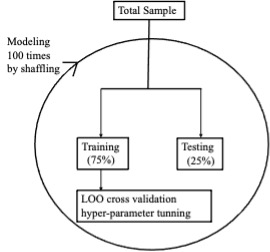
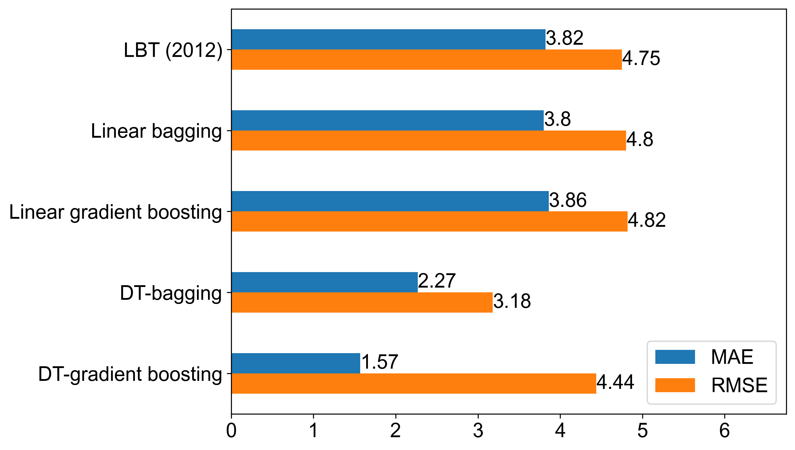
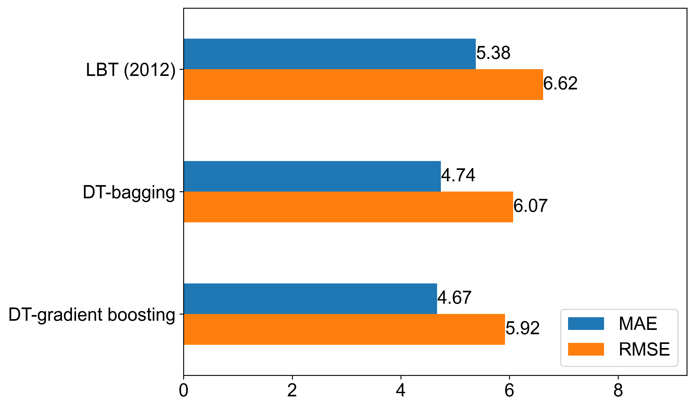
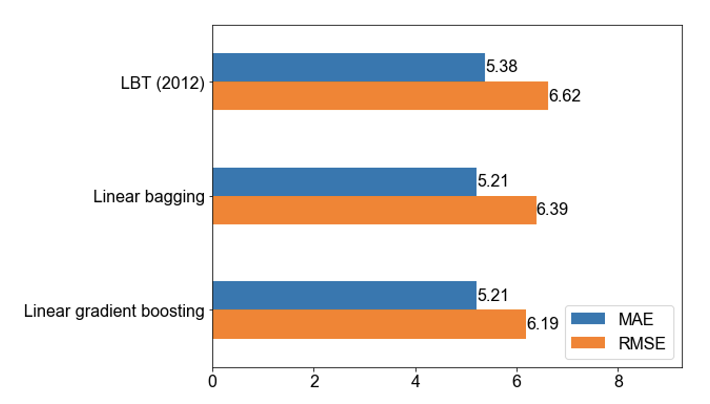
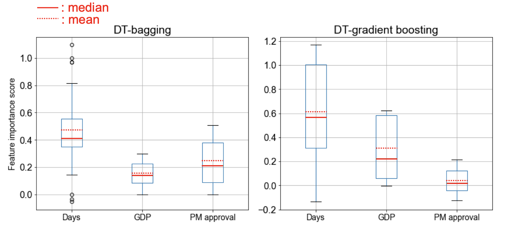
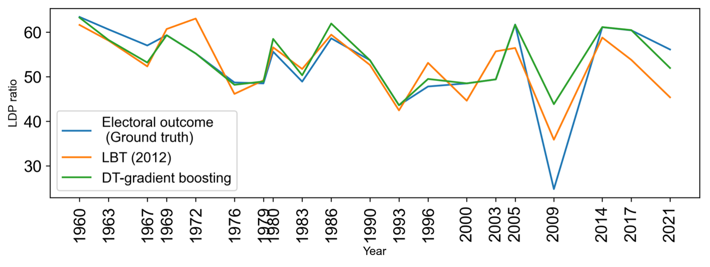

# Forecasting Japanese elections: A nonlinear machine-learning approach
This is the original scikit-learn implement of the paper: "Forecasting Japanese elections: A nonlinear machine-learning approach"

# Requirements
- Python 3.7.9
- pandas==1.1.4
- matplotlib==3.4.0
- numpy==1.19.4
- scikit_learn==1.2.0

Dependencies can be installed using the following command:
```c
pip install -r ./requirements.txt
```

# Model evaluation
## To evaluate the proposed or benchmark models (except linear gradient boosting), please run the following command:
```c
python forcasting_best_param.py
```
The parameter that you can change are shown in following table:

|  Parameter name  | Description of parameter                  |
| ---- |-------------------------------------------|
|  method  | The proposed or the benchmarked model     |
|  data  | The dataset used for training and testing |
|  seed_num  | The seed num                              |

## To evaluate the linear gradient boosting model, please run the following command:
```c
python pred_blr.py
```

The parameter that you can change are shown in following table:

|  Parameter name  | Description of parameter                  |
| ---- |-------------------------------------------|
|  learning_rate  | The learning rate                         |
|  data  | The dataset used for training and testing |
|  max_iter  | The max ieration                          |
|  early_stopping  | Whether set the early stopping            |

# Japanese election data
The Japanese election dataset which can be publically accesible is shown below:
```python
Year LDP_seats GDP PM_approval DAYS
1960	63.4	9.42	41.6	913
1963	60.6	8.6	38.7	1096
1967	57	10.25	25.8	1165
1969	59.3	11.91	37.9	1063
1972	55.2	4.39	54.8	1079
1976	48.7	3.09	29.5	1456
1979	48.5	5.27	26	1036
1980	55.6	5.48	29.1	259
1983	48.9	3.38	37.3	1274
1986	58.6	6.33	42.6	931
1990	53.7	5.37	36.5	1323
1993	43.6	0.82	23.1	1246
1996	47.8	2.74	39.8	1190
2000	48.5	-0.25	30.4	1344
2003	49.4	0.12	49.6	1232
2005	61.7	2.2	39.9	672
2009	24.8	-1.09	16.3	1449
2012	61.3	-0.12	17.3	1204
2014	61.1	2	45.5	728
2017	60.4	1.03	41.8	1043
2021	56.1	-4.4	40.3	1470
```

The training and evaluating flow chart is shown as below:



# The performance of the proposed ensemble learning and benchmark models 
- in-sample performance


- out-of-sample performance



# The feature importance score of the DT-bagging and DT-gradient boosting models.

The feature importance of the DT-bagging and DT-gradient boosting models are shown as below:



# The forecasting results by the proposed and benchmark models.
The forecasting results by the proposed and benchmark models on 1960-2012 dataset are shown below:



 
