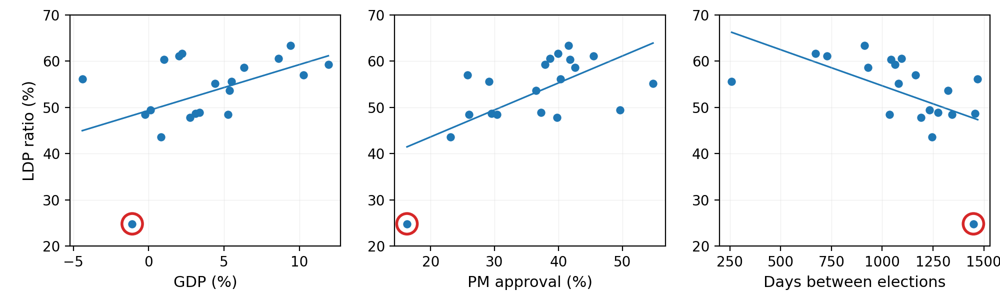
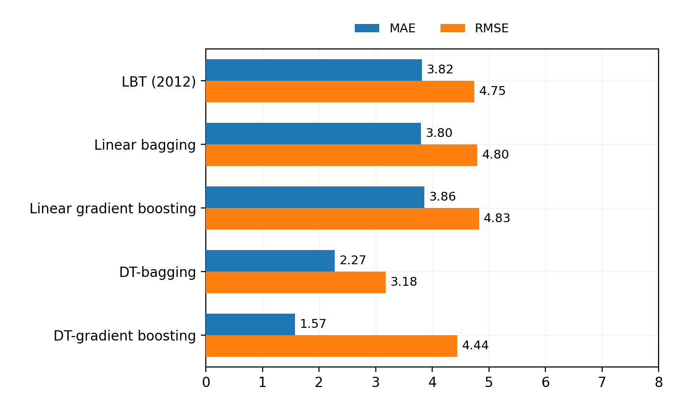
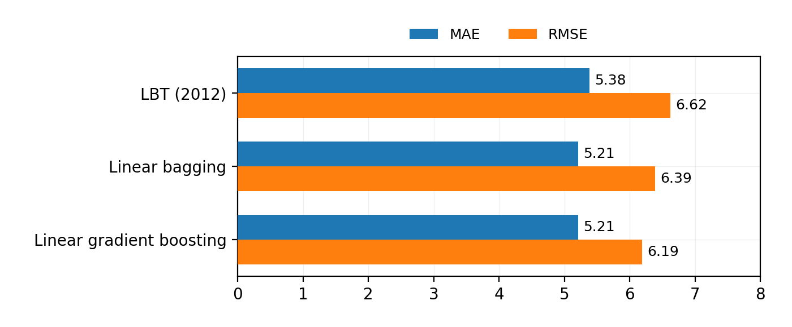
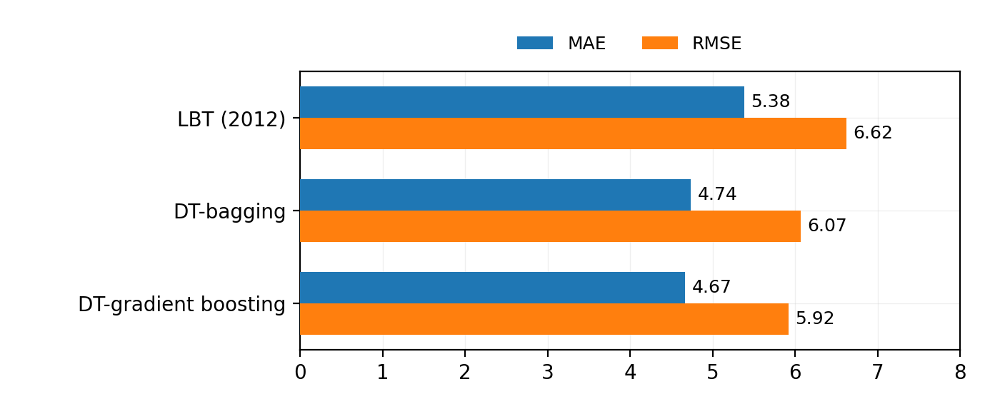
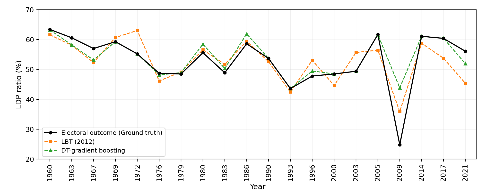
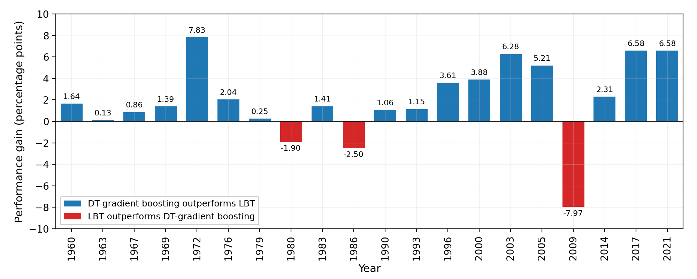
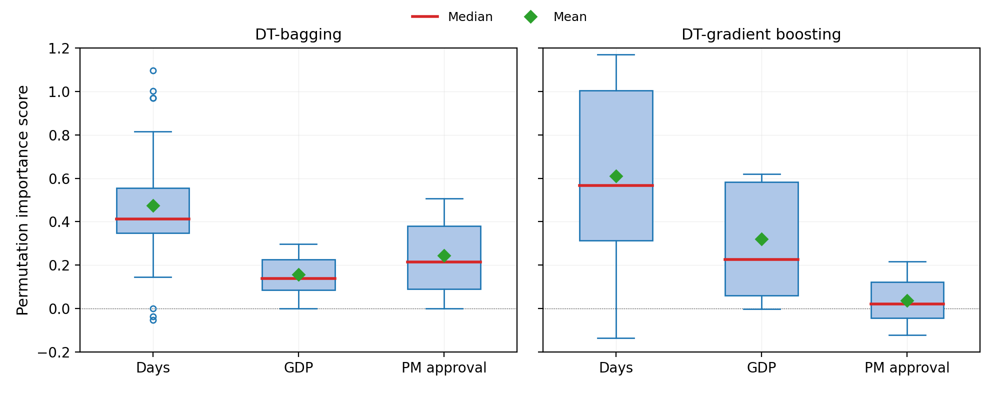

# Forecasting Japanese elections: A nonlinear machine-learning approach

This repository is the reproducibility package for the paper:

> Sota Kato, Xuan Luo, Budrul Ahsan, Asahi Obata, and Takafumi Nakanishi. "Forecasting Japanese elections: A nonlinear machine-learning approach." *International Journal of Forecasting*.

**Package assembled:** 2026-06-06

---

## Authors and contact

| Name | Contact |
|------|---------|
| Sota Kato | skato@glocom.ac.jp, sotakatoj@gmail.com|
| Xuan Luo | rosengaga@gmail.com |
| Budrul Ahsan | |
| Asahi Obata | |
| Takafumi Nakanishi | |

For questions regarding this reproducibility package, please contact **Xuan Luo** at rosengaga@gmail.com.

---

## Repository structure

```
forecasting_japanese_election_clean/
│
├── data/                          # Raw input data
│   └── data_election_2020_correct2012.csv
│
├── intermediary_data/             # Outputs of forcasting_best_param.py
│   ├── model_results_N2012.csv
│   ├── model_results_U2009.csv
│   ├── model_results_N2009_2012.csv
│   ├── predictions_N2012.csv
│   └── feature_importance_N2012.json
│
├── figure_table_data/             # Formatted inputs for figures and tables
│   ├── fig1_data.csv
│   ├── fig2_3_4_data.csv
│   ├── fig5_6_data.csv
│   ├── fig7_data.csv
│   ├── tableA1_data.csv
│   └── tableA2_data.csv
│
├── output/                        # Final figures and tables
│   ├── fig1.png / fig1.pdf
│   ├── fig2.png / fig2.pdf
│   ├── ...
│   ├── table1.csv – table4.csv
│   ├── tableA1.csv, tableA2.csv
│
├── forcasting_best_param.py       # Main training script (all models, all conditions)
├── prepare_data.py                # Converts intermediary_data/ → figure_table_data/
├── make_figures.py                # Generates all figures (Fig. 1–7)
├── make_tables.py                 # Generates all tables (Table 1–4, A1–A2)
├── boostedLinearRegression.py     # Custom BLR model implementation
└── requirements.txt
```

---

## Computing environment

- **Language:** Python 3.7.9
- **License:** MIT
- **Platform tested:** macOS (MacBook)

Install all dependencies using:

```bash
pip install -r requirements.txt
```

**Package versions (requirements.txt):**

| Package | Version |
|---------|---------|
| pandas | 1.1.4 |
| matplotlib | 3.4.0 |
| numpy | 1.19.4 |
| scikit-learn | 1.2.0 |
| xgboost | 1.2.1 |

> **Note:** Exact numerical reproducibility requires using the package versions listed above. Differences in numpy and scikit-learn versions affect random number sequences, which can cause ±0.01 differences in reported metrics.

To replicate the exact environment using conda:

```bash
conda create -n election_forecast python=3.7.9
conda activate election_forecast
pip install -r requirements.txt
```

No GPU or parallel computing is required. All experiments run on a standard CPU.

---

## Data

The dataset covers 20 Japanese general elections from 1960 to 2021 (the 2012 election is excluded from model training and evaluation; see the paper for details).

**File:** `data/data_election_2020_correct2012.csv`

| Variable | Description | Source |
|----------|-------------|--------|
| `Year` | Election year | — |
| `LDP_seats` | LDP seat share (%) | — |
| `LDP_votes` | LDP vote share (%) | — |
| `GDP` | GDP growth rate (%) | Economic outlook |
| `PM_approval` | Cabinet approval rating (%) | Jiji Press |
| `DAYS` | Days elapsed since previous election | — |

The dataset is directly included in this repository. No additional download is required.

```
Year  LDP_seats   GDP  PM_approval  DAYS
1960       63.4  9.42         41.6   913
1963       60.6  8.60         38.7  1096
1967       57.0 10.25         25.8  1165
1969       59.3 11.91         37.9  1063
1972       55.2  4.39         54.8  1079
1976       48.7  3.09         29.5  1456
1979       48.5  5.27         26.0  1036
1980       55.6  5.48         29.1   259
1983       48.9  3.38         37.3  1274
1986       58.6  6.33         42.6   931
1990       53.7  5.37         36.5  1323
1993       43.6  0.82         23.1  1246
1996       47.8  2.74         39.8  1190
2000       48.5 -0.25         30.4  1344
2003       49.4  0.12         49.6  1232
2005       61.7  2.20         39.9   672
2009       24.8 -1.09         16.3  1449
2014       61.1  2.00         45.5   728
2017       60.4  1.03         41.8  1043
2021       56.1 -4.40         40.3  1470
```

---

## Reproducing tables and figures

All tables and figures are produced by running four scripts in sequence:

```bash
python forcasting_best_param.py   # Train all models → intermediary_data/
python prepare_data.py            # Format data     → figure_table_data/
python make_figures.py            # Draw figures    → output/
python make_tables.py             # Build tables    → output/
```

**Expected outputs:**

| Output file | Paper reference |
|-------------|-----------------|
| `output/fig1.pdf` | Figure 1 |
| `output/fig2.pdf` | Figure 2 |
| `output/fig3.pdf` | Figure 3 |
| `output/fig4.pdf` | Figure 4 |
| `output/fig5.pdf` | Figure 5 |
| `output/fig6.pdf` | Figure 6 |
| `output/fig7.pdf` | Figure 7 |
| `output/table1.csv` | Table 1 |
| `output/table2.csv` | Table 2 |
| `output/table3.csv` | Table 3 |
| `output/table4.csv` | Table 4 |
| `output/tableA1.csv` | Table A1 (Appendix) |
| `output/tableA2.csv` | Table A2 (Appendix) |

---

## Runtime

- **Hardware:** MacBook (standard CPU, no GPU required)
- **Expected total runtime:** approximately 20 minutes
- The most time-consuming step is `forcasting_best_param.py`, which trains 7 model variants across up to 100 random seeds for three data conditions.

---

## Figures

**Figure 1.** Scatter plots of explanatory variables vs. LDP seat share (1960–2021, 2012 excluded). The 2009 election is marked as an outlier.



**Figure 2.** In-sample performance (MAE and RMSE) of all models.



**Figure 3.** Out-of-sample performance of linear ensemble models.



**Figure 4.** Out-of-sample performance of DT-based ensemble models.



**Figure 5.** Forecasting results vs. electoral outcomes (1960–2021).



**Figure 6.** Performance gain of DT-gradient boosting over LBT.



**Figure 7.** Permutation feature importance for DT-bagging and DT-gradient boosting.


