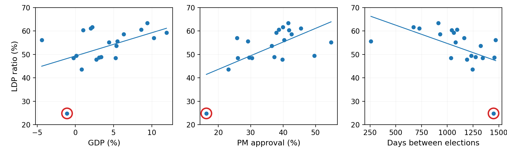
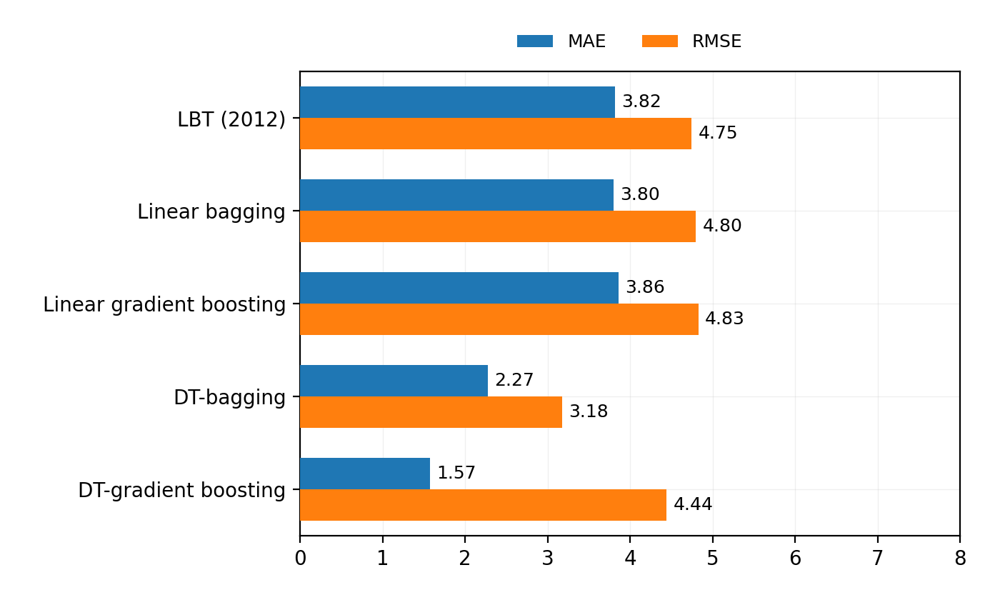
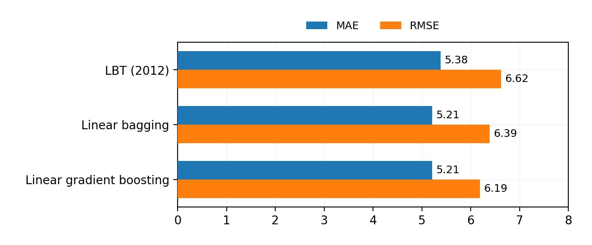
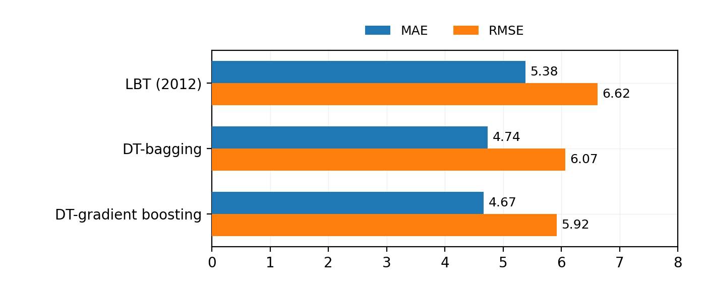
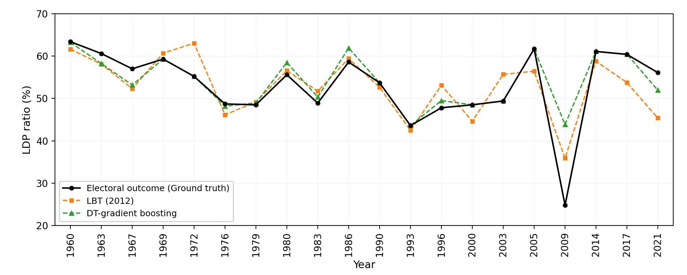
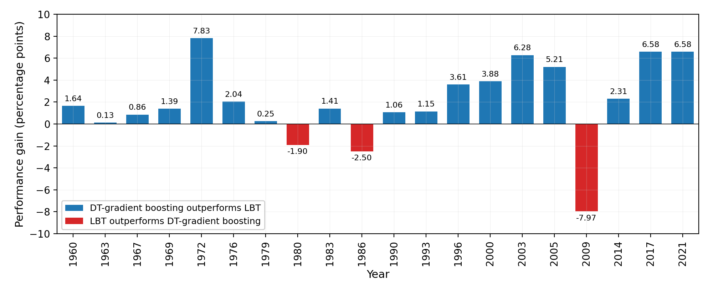
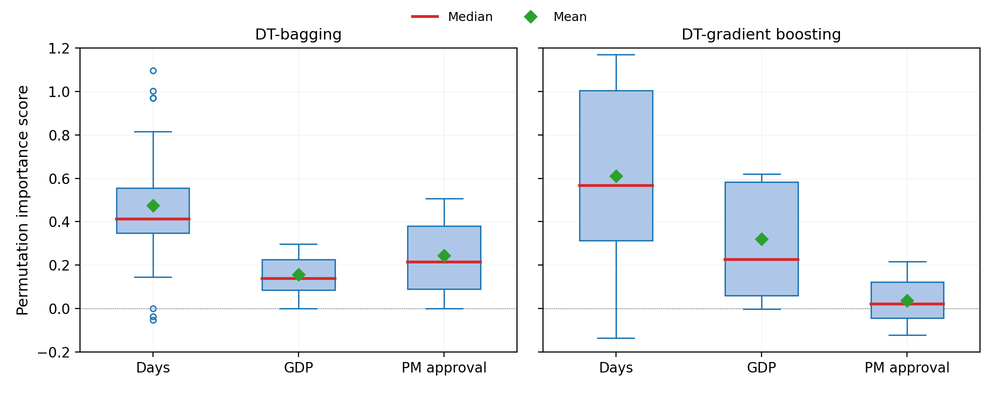

# Forecasting Japanese elections: A nonlinear machine-learning approach

This repository is the reproducibility package for the paper:

> Sota Kato, Xuan Luo, Budrul Ahsan, Asahi Obata, and Takafumi Nakanishi. "Forecasting Japanese elections: A nonlinear machine-learning approach." *International Journal of Forecasting*.

**Package assembled:** 2026-07-01

---

## Authors and contact

| Name | Contact |
|------|---------|
| Sota Kato | skato@glocom.ac.jp, sotakatoj@gmail.com|
| Xuan Luo | rosengaga@gmail.com |
| Budrul Ahsan | |
| Asahi Obata | |
| Takafumi Nakanishi | |

For questions regarding this reproducibility package, please contact **Xuan Luo** at rosengaga@gmail.com.

---

## Repository structure

```
forecasting_japanese_election_clean/
│
├── data/                          # Raw input data
│   └── japanese_election_until_2021.csv
│
├── intermediary_data/             # Outputs of forcasting_best_param.py
│   ├── model_results_N2012.csv
│   ├── model_results_U2009.csv
│   ├── model_results_N2009_2012.csv
│   ├── predictions_N2012.csv
│   └── feature_importance_N2012.json
│
├── figure_table_data/             # Formatted inputs for figures and tables
│   ├── fig1_data.csv
│   ├── fig2_3_4_data.csv
│   ├── fig5_6_data.csv
│   ├── fig7_data.csv
│   ├── tableA1_data.csv
│   └── tableA2_data.csv
│
├── output/                        # Final figures and tables
│   ├── fig1.png / fig1.pdf
│   ├── fig2.png / fig2.pdf
│   ├── ...
│   ├── table1.csv – table4.csv
│   ├── tableA1.csv, tableA2.csv
│
├── forcasting_best_param.py       # Main training script (all models, all conditions)
├── prepare_data.py                # Converts intermediary_data/ → figure_table_data/
├── make_figures.py                # Generates all figures (Fig. 1–7)
├── make_tables.py                 # Generates all tables (Table 1–4, A1–A2)
├── boostedLinearRegression.py     # Custom BLR model implementation
└── requirements.txt
```

---

## Computing environment

- **Language:** Python 3.7.9
- **License:** No proprietary software is required to run the reproducibility check; all software used (Python, scikit-learn, etc.) is open-source. Terms for the data are described in the Data section.
- **Platform tested:** macOS (MacBook)

Python 3.7.9 is not available via pip and must be installed via conda. To replicate the exact environment:

```bash
conda create -n ijf-election-replication python=3.7.9
conda activate ijf-election-replication
pip install -r requirements.txt
```

**Package versions (requirements.txt):**

| Package | Version |
|---------|---------|
| pandas | 1.1.4 |
| matplotlib | 3.4.0 |
| numpy | 1.19.4 |
| scikit-learn | 1.2.0 |
| xgboost | 1.2.1 |

> **Note:** The reported results were produced with the package versions listed above and are reproduced exactly under that environment. Running the code with a different set of library versions may produce very small numerical differences in some reported metrics.

No GPU, parallel computing, or other special setup is required. All experiments run on a standard CPU.

---

## Data

The dataset covers 20 Japanese general elections from 1960 to 2021 (the 2012 election is excluded from model training and evaluation; see the paper for details).

**File:** `data/japanese_election_until_2021.csv`

| Variable      | Description                          | Source |
| ------------- | ------------------------------------ | ------ |
| `Year`        | Election year                        | —      |
| `LDP_seats`   | LDP seat share (%)                   | Ministry of Internal Affairs and Communications |
| `GDP`         | GDP growth rate (%)                  | ESRI, Cabinet Office, Japan |
| `PM_approval` | Cabinet approval rating (%)          | Jiji Press |
| `DAYS`        | Days elapsed since previous election | —      |

**LDP_seats:**
> The column labeled LDP_seats in the replication CSV contains the LDP seat-occupancy rate (percent), not a raw seat count.
> **Source**: Party-level seat totals for each House of Representatives election were compiled from the official election returns published by the Ministry of Internal Affairs and Communications (and its predecessor ministries), specifically the Results of the House of Representatives General Election and the National Review of Supreme Court Justices. The compiled figures were then cross-checked against election results reported by Asahi Shimbun and NHK. 
> > Notes on seat counts: For some elections, the party seat totals include members endorsed by the party shortly after polling day (post-election endorsees), whom the official election returns record as independents. For those elections, the figures used here can therefore differ slightly from the official election-returns totals (e.g., the 2021 House of Representatives election: LDP = 261 including two post-election endorsees, vs. 259 on the election-returns basis).

**GDP:**
> **Source**: Economic and Social Research Institute (ESRI), Cabinet Office, Government of Japan —> National Accounts of Japan. For each general election, the value is the real GDP growth rate of the calendar year preceding the election. 
> > Notes: Historical GDP growth figures were compiled from the Cabinet Office's published national accounts across benchmark revisions. Because the underlying official series span successive changes in base year and SNA framework, earlier observations reflect older benchmark vintages and therefore do not always coincide with the currently published chain-linked series. The analysis uses the snapshot included in the replication package. Access date: [2026-07-01].

**PM_approval:**
> **Source**: Jiji Press monthly national public opinion poll ("Jiji Yoron Chosa"), conducted by Central Research Services, Inc. (Chuo Chosa Sha) for Jiji Press every month since 1960 and published in Chuo Chosa Ho. For each election, the value is the cabinet approval rate surveyed one month prior to the election. 
> > Notes: The survey is conducted nationwide among adults aged 18 and over (20 and over before 2016) using in-person interviews. The original copyrighted articles are not redistributed in this package; the analysis-ready values are included in the replication CSV. Access to the original source articles is not required to reproduce any table or figure in the paper.

**DAYS:**
> The Days variable is the number of days between two consecutive general elections, computed from the official election dates.

The dataset is directly included in this repository. No additional download is required.

```
Year  LDP_seats   GDP  PM_approval  DAYS
1960       63.4  9.42         41.6   913
1963       60.6  8.60         38.7  1096
1967       57.0 10.25         25.8  1165
1969       59.3 11.91         37.9  1063
1972       55.2  4.39         54.8  1079
1976       48.7  3.09         29.5  1456
1979       48.5  5.27         26.0  1036
1980       55.6  5.48         29.1   259
1983       48.9  3.38         37.3  1274
1986       58.6  6.33         42.6   931
1990       53.7  5.37         36.5  1323
1993       43.6  0.82         23.1  1246
1996       47.8  2.74         39.8  1190
2000       48.5 -0.25         30.4  1344
2003       49.4  0.12         49.6  1232
2005       61.7  2.20         39.9   672
2009       24.8 -1.09         16.3  1449
2014       61.1  2.00         45.5   728
2017       60.4  1.03         41.8  1043
2021       56.1 -4.40         40.3  1470
```

---

## Reproducing tables and figures

All tables and figures are produced by running four scripts in sequence:

```bash
python forcasting_best_param.py   # Train all models → intermediary_data/
python prepare_data.py            # Format data     → figure_table_data/
python make_figures.py            # Draw figures    → output/*.png, output/*.pdf
python make_tables.py             # Build tables    → output/.csv
```

**Expected outputs:**

| Output file | Paper reference |
|-------------|-----------------|
| `output/fig1.png`, `output/fig1.pdf` | Figure 1 |
| `output/fig2.png`, `output/fig2.pdf` | Figure 2 |
| `output/fig3.png`, `output/fig3.pdf` | Figure 3 |
| `output/fig4.png`, `output/fig4.pdf` | Figure 4 |
| `output/fig5.png`, `output/fig5.pdf` | Figure 5 |
| `output/fig6.png`, `output/fig6.pdf` | Figure 6 |
| `output/fig7.png`, `output/fig7.pdf` | Figure 7 |
| `output/table1.csv` | Table 1 |
| `output/table2.csv` | Table 2 |
| `output/table3.csv` | Table 3 |
| `output/table4.csv` | Table 4 |
| `output/tableA1.csv` | Table A1 (Appendix) |
| `output/tableA2.csv` | Table A2 (Appendix) |

---

## Runtime

- **Hardware:** MacBook (standard CPU, no GPU required)
- **Expected total runtime:** approximately 20 minutes
- The most time-consuming step is `forcasting_best_param.py`, which trains 7 model variants across up to 100 random seeds for three data conditions.

---

## Figures

**Figure 1.** Scatter plots of explanatory variables vs. LDP seat share (1960–2021, 2012 excluded). The 2009 election is marked as an outlier.



**Figure 2.** In-sample performance (MAE and RMSE) of all models.



**Figure 3.** Out-of-sample performance of linear ensemble models.



**Figure 4.** Out-of-sample performance of DT-based ensemble models.



**Figure 5.** Forecasting results vs. electoral outcomes (1960–2021).



**Figure 6.** Performance gain of DT-gradient boosting over LBT.



**Figure 7.** Permutation feature importance for DT-bagging and DT-gradient boosting.

